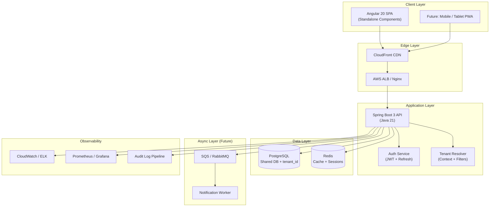
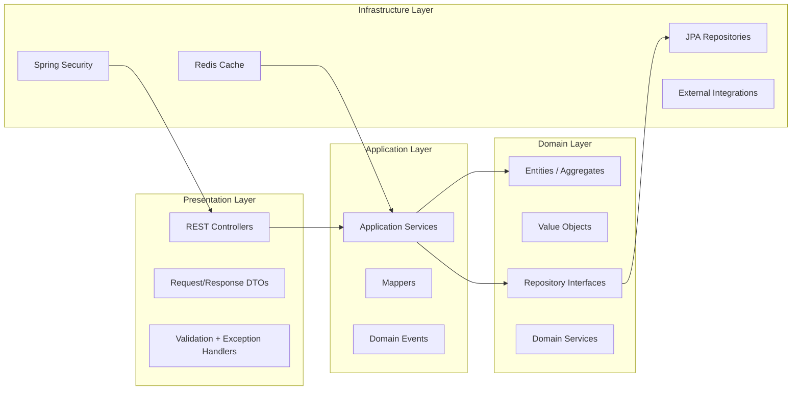
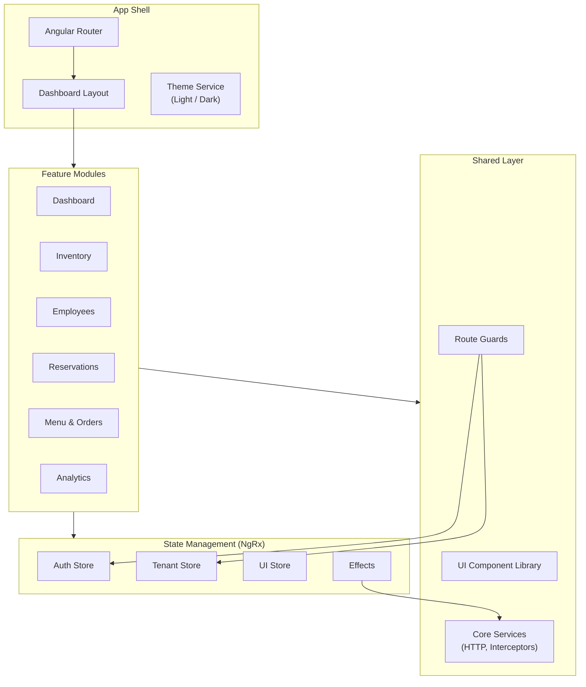
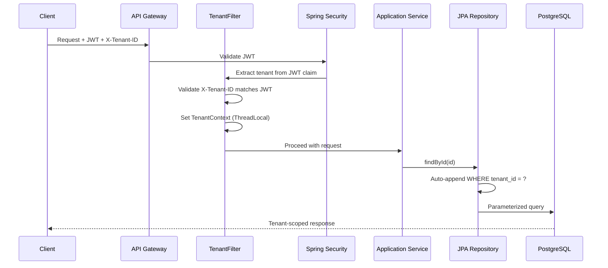
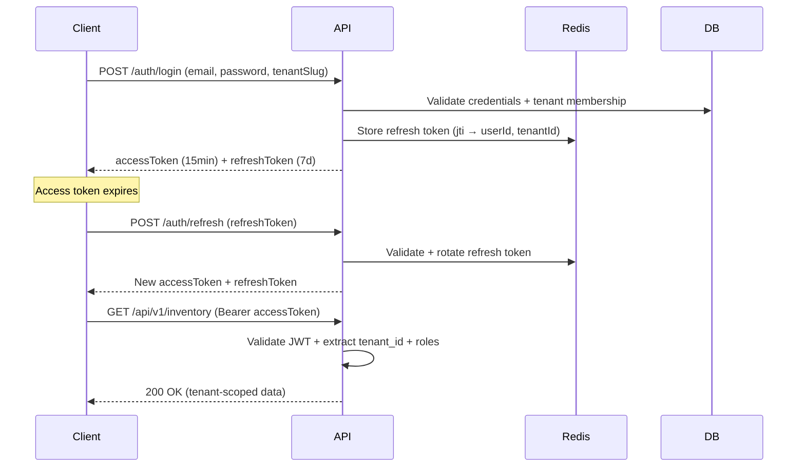
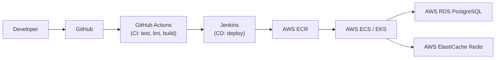

# ResOS — System Architecture Overview

> **Phase 1 Deliverable** | Multi-Tenant Restaurant Management SaaS  
> **Status:** Awaiting Review  
> **Version:** 1.0.0

---

## 1. Executive Summary

ResOS is a production-grade, multi-tenant SaaS platform for restaurant operations. Each restaurant (tenant) operates in complete data isolation while sharing a common application infrastructure. The system follows **Clean Architecture**, **Domain-Driven Design (DDD)**, and **SOLID** principles.

### Target Users

| Role | Scope | Primary Capabilities |
|------|-------|---------------------|
| **System Administrator** | Platform-wide | Tenant provisioning, billing oversight, platform analytics |
| **Restaurant Owner** | Single tenant | Full tenant control, billing, settings, all modules |
| **Restaurant Manager** | Single tenant | Operations, staff, inventory, reservations, orders |
| **Staff Member** | Single tenant | Orders, reservations (limited), assigned tasks |

---

## 2. High-Level Architecture Diagram



---

## 3. Layered Architecture (Backend)



### Layer Responsibilities

| Layer | Responsibility | Dependencies |
|-------|---------------|--------------|
| **Presentation** | HTTP handling, DTO mapping, input validation | Application |
| **Application** | Use cases, orchestration, transactions | Domain |
| **Domain** | Business rules, entities, invariants | None (pure) |
| **Infrastructure** | Persistence, security, caching, messaging | Domain interfaces |

---

## 4. Frontend Architecture



---

## 5. Multi-Tenant Architecture Decision

### Chosen Strategy: **Shared Database, Shared Schema with Discriminator Column**

```
┌─────────────────────────────────────────────────────────┐
│                    PostgreSQL                           │
│  ┌─────────────┐  ┌─────────────┐  ┌─────────────┐     │
│  │  Tenant A   │  │  Tenant B   │  │  Tenant C   │     │
│  │ tenant_id=A │  │ tenant_id=B │  │ tenant_id=C │     │
│  └─────────────┘  └─────────────┘  └─────────────┘     │
│         All rows in shared tables, filtered by tenant_id│
└─────────────────────────────────────────────────────────┘
```

### Why This Approach?

| Criteria | Shared DB + tenant_id | Schema-per-Tenant | DB-per-Tenant |
|----------|----------------------|-------------------|---------------|
| Cost efficiency | ✅ High | ⚠️ Medium | ❌ Low |
| Operational complexity | ✅ Low | ⚠️ Medium | ❌ High |
| Tenant isolation | ⚠️ Application-enforced | ✅ Strong | ✅ Strongest |
| Cross-tenant analytics | ✅ Easy | ❌ Hard | ❌ Hard |
| Migration management | ✅ Single schema | ⚠️ N schemas | ❌ N databases |
| Startup SaaS fit | ✅ Best | ⚠️ Overkill early | ❌ Enterprise only |

### Tenant Isolation Enforcement (Defense in Depth)



**Isolation Layers:**

1. **JWT Claim** — `tenant_id` embedded in access token
2. **Request Header** — `X-Tenant-ID` must match JWT claim
3. **TenantContext** — ThreadLocal holder set by servlet filter
4. **Hibernate Filter** — `@Filter(name = "tenantFilter")` on all tenant-scoped entities
5. **Repository Base** — `TenantAwareRepository` auto-applies tenant predicate
6. **Integration Tests** — Cross-tenant access attempts must return 403/404

---

## 6. Authentication Strategy

### Token Flow



### Token Structure

| Token | Lifetime | Storage (Client) | Claims |
|-------|----------|------------------|--------|
| Access Token | 15 minutes | Memory (NgRx store) | `sub`, `tenant_id`, `roles[]`, `permissions[]`, `exp` |
| Refresh Token | 7 days | HttpOnly Secure Cookie | Opaque UUID, stored server-side in Redis |

### RBAC Model

```
User ──► UserRole ──► Role ──► RolePermission ──► Permission

Platform Roles (tenant_id = NULL):
  └── SUPER_ADMIN

Tenant Roles (scoped to tenant_id):
  ├── TENANT_OWNER    → All tenant permissions
  ├── MANAGER         → Operations, reports, staff (no billing)
  └── STAFF           → Orders, reservations (read), assigned tasks
```

---

## 7. State Management Strategy (Frontend)

| Store Slice | Contents | Persistence |
|-------------|----------|-------------|
| **auth** | user, accessToken, isAuthenticated, permissions | Session only |
| **tenant** | currentTenant, tenantSettings, slug | Session + localStorage (slug) |
| **ui** | theme (light/dark), sidebar state, loading | localStorage |
| **feature stores** | Per-feature entity caches (inventory, orders, etc.) | Memory (refetched on nav) |

**NgRx Effects** handle side effects: login, token refresh, tenant switch, API error normalization.

**Angular Signals** used for local component state (form state, UI toggles) where NgRx would be overkill.

---

## 8. Caching Strategy

| Cache Key Pattern | TTL | Purpose |
|-------------------|-----|---------|
| `tenant:{id}:settings` | 1 hour | Tenant configuration |
| `user:{id}:permissions` | 15 min | RBAC permission set |
| `menu:{tenantId}:active` | 30 min | Active menu for POS |
| `refresh:{jti}` | 7 days | Refresh token validation |
| `ratelimit:{ip}:{endpoint}` | 1 min | API rate limiting |

**Cache Invalidation:** Event-driven on writes (e.g., menu update → evict `menu:{tenantId}:*`).

---

## 9. Subscription & Billing Ready Architecture

Designed for future Stripe integration without refactoring core domain:

```
Tenant ──► Subscription ──► Plan ──► PlanFeature (limits)

Plan tiers (planned):
  STARTER   → 1 location, 5 staff, basic modules
  PRO       → 3 locations, 25 staff, analytics
  ENTERPRISE → Unlimited, API access, priority support
```

Feature flags enforced at **Application Service** layer via `@RequiresPlan("ANALYTICS")` annotation.

---

## 10. Testing Strategy

| Layer | Tool | Scope |
|-------|------|-------|
| Unit | JUnit 5 + Mockito | Domain logic, services, mappers |
| Integration | Spring Boot Test + Testcontainers | Repositories, API endpoints, tenant isolation |
| API Contract | REST Assured / Postman Collections | OpenAPI validation |
| Frontend Unit | Jasmine + Karma | Components, pipes, reducers |
| E2E | Cypress | Critical user flows per phase |
| Tenant Isolation | Dedicated test suite | Cross-tenant access MUST fail |
| Performance | k6 (Phase 10) | Load testing baseline |

---

## 11. DevOps Architecture (Planned — Phase 10)



---

## 12. Non-Functional Requirements

| Requirement | Target |
|-------------|--------|
| API Response Time (p95) | < 200ms |
| Uptime SLA | 99.9% |
| Concurrent Tenants | 1,000+ |
| Data Retention (audit logs) | 7 years |
| Password Policy | BCrypt, min 12 chars |
| HTTPS | TLS 1.3 everywhere |
| CORS | Whitelist tenant domains |
| Rate Limiting | 100 req/min per user |

---

## 13. Security Checklist

- [ ] JWT signed with RS256 (asymmetric keys)
- [ ] Refresh token rotation on every use
- [ ] CSRF protection on cookie-based refresh
- [ ] SQL injection prevention (parameterized queries only)
- [ ] XSS prevention (Angular sanitization + CSP headers)
- [ ] Tenant isolation integration tests on every PR
- [ ] Audit log for all write operations
- [ ] Secrets in AWS Secrets Manager (not env files in prod)
- [ ] OWASP Top 10 review before Phase 10

---

*Next: Review this document, then proceed to [Folder Structure](./02-folder-structure.md)*
