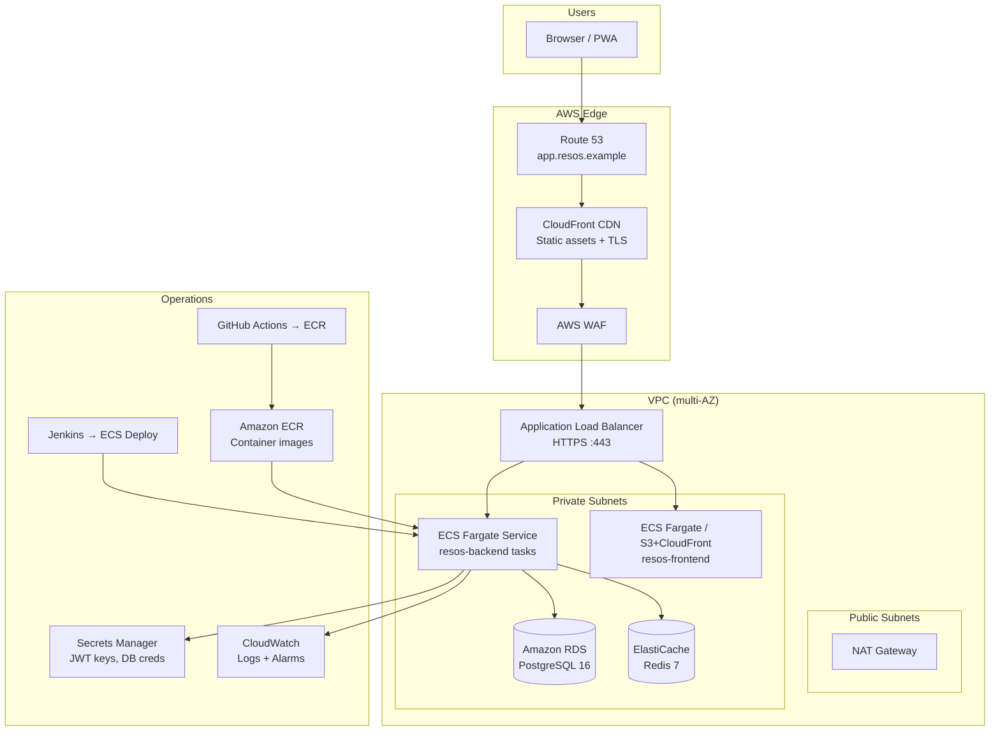
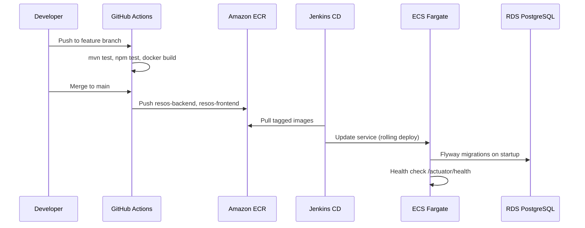

# ResOS — AWS Architecture

> **Phase 10 Deliverable** | Cloud Reference Architecture  
> **Status:** AWS-ready (not yet provisioned)

---

## 1. Design Goals

- **Multi-tenant SaaS** with defense-in-depth isolation (`tenant_id` + Hibernate filters)
- **Horizontal scaling** of stateless API containers
- **Managed data stores** (RDS PostgreSQL, ElastiCache Redis)
- **Zero-trust edge** — TLS everywhere, JWT auth, least-privilege IAM
- **Observable** — structured logs, metrics, audit trail

---

## 2. Reference Architecture



---

## 3. Service Mapping

| ResOS Component | AWS Service | Notes |
|-----------------|-------------|-------|
| Angular SPA | S3 + CloudFront **or** ECS Fargate + ALB | Compose uses Nginx; map to CloudFront origin or Fargate task |
| Spring Boot API | ECS Fargate (2+ tasks) | Stateless; scale on CPU / request count |
| PostgreSQL | RDS PostgreSQL 16 | Multi-AZ for production; Flyway migrations on deploy |
| Redis | ElastiCache Redis 7 | Session/cache; cluster mode for HA |
| TLS certificates | ACM | Terminate at ALB / CloudFront |
| Secrets | Secrets Manager | JWT RSA keys, DB password, Redis auth |
| Container registry | ECR | Images pushed from CI/CD |
| DNS | Route 53 | `app.resos.example`, `api.resos.example` (optional split) |
| Logs | CloudWatch Logs | JSON log driver on ECS tasks |
| Metrics | CloudWatch + optional Prometheus | Actuator `/actuator/health`, custom metrics |
| Audit logs | CloudWatch Logs + S3 archive | Long-term retention for compliance |

---

## 4. Network Layout

```
VPC 10.0.0.0/16
├── Public subnet A  10.0.1.0/24  (AZ-a) — ALB, NAT
├── Public subnet B  10.0.2.0/24  (AZ-b) — ALB
├── Private subnet A 10.0.10.0/24 (AZ-a) — ECS, RDS primary
├── Private subnet B 10.0.11.0/24 (AZ-b) — ECS, RDS standby
└── Data subnet      10.0.20.0/24 — RDS, ElastiCache (no internet)
```

Security groups:

| SG | Inbound | Source |
|----|---------|--------|
| `alb-sg` | 443 | `0.0.0.0/0` |
| `ecs-api-sg` | 8080 | `alb-sg` |
| `rds-sg` | 5432 | `ecs-api-sg` |
| `redis-sg` | 6379 | `ecs-api-sg` |

---

## 5. Deployment Flow



---

## 6. ECS Task Definition (Backend)

Key environment variables (inject from Secrets Manager):

| Name | Source |
|------|--------|
| `SPRING_PROFILES_ACTIVE` | `prod` |
| `SPRING_DATASOURCE_URL` | RDS endpoint |
| `SPRING_DATASOURCE_USERNAME` | Secrets Manager |
| `SPRING_DATASOURCE_PASSWORD` | Secrets Manager |
| `REDIS_HOST` | ElastiCache endpoint |
| `RESOS_JWT_PRIVATE_KEY` | Secrets Manager |
| `RESOS_JWT_PUBLIC_KEY` | Secrets Manager |
| `RESOS_CORS_ALLOWED_ORIGINS` | Parameter Store |

Health check: `GET /actuator/health` on port 8080.

---

## 7. Cost Optimization (Starter Tier)

| Service | Starter sizing |
|---------|----------------|
| ECS Fargate | 0.5 vCPU / 1 GB × 2 tasks |
| RDS | `db.t4g.micro`, 20 GB gp3 |
| ElastiCache | `cache.t4g.micro` |
| CloudFront | Pay per request |
| NAT Gateway | Single AZ (dev/staging); dual NAT for prod HA |

Use **AWS Free Tier** where applicable for staging environments.

---

## 8. Disaster Recovery

| RPO | RTO | Mechanism |
|-----|-----|-----------|
| 5 min | 30 min | RDS automated backups + Multi-AZ failover |
| 24 h | 4 h | Cross-region RDS snapshot copy (optional) |

Runbook: restore RDS snapshot → redeploy ECS tasks → verify Flyway schema version.

---

## 9. Future Enhancements

- **SQS** — async notifications (order alerts, low-stock emails)
- **OpenSearch** — full-text audit log search
- **Cognito** — optional external IdP federation
- **EKS** — migrate from Fargate if Kubernetes tooling is required
- **Multi-region** — Route 53 latency routing for global tenants

---

## 10. Related Documentation

- [Production Deployment Guide](../deployment/production-deployment-guide.md)
- [System Overview](01-system-overview.md)
- [Database Schema](../database/schema-design.md)
