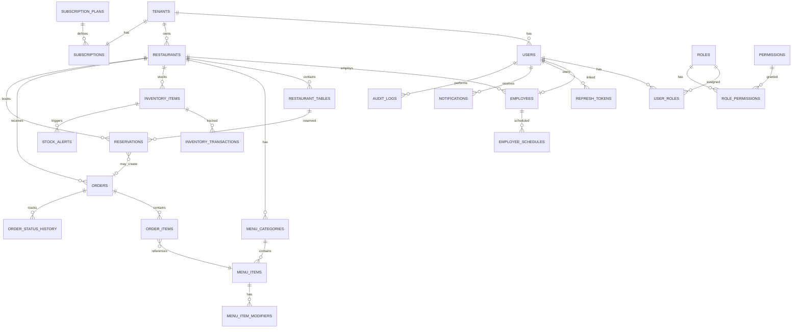

# ResOS — Database Schema Design

> **Phase 1 Deliverable** | PostgreSQL Schema  
> **Status:** Awaiting Review

---

## 1. Design Principles

- **UUID primary keys** — No sequential ID leakage across tenants
- **tenant_id on every tenant-scoped table** — Enforced at application + Hibernate filter level
- **Soft deletes** — `deleted_at` timestamp (never hard-delete tenant data)
- **Audit columns** — `created_at`, `updated_at`, `created_by`, `updated_by` on all entities
- **Optimistic locking** — `version` column on mutable entities
- **Flyway migrations** — Version-controlled, incremental schema changes
- **Indexes** — Composite indexes on `(tenant_id, ...)` for all tenant-scoped queries

---

## 2. Entity Relationship Diagram



---

## 3. Core Tables

### 3.1 Tenants

```sql
CREATE TABLE tenants (
    id              UUID PRIMARY KEY DEFAULT gen_random_uuid(),
    name            VARCHAR(255) NOT NULL,
    slug            VARCHAR(100) NOT NULL UNIQUE,       -- URL-safe identifier (e.g., "joes-pizza")
    email           VARCHAR(255) NOT NULL,
    phone           VARCHAR(20),
    address         TEXT,
    timezone        VARCHAR(50) NOT NULL DEFAULT 'UTC',
    currency        VARCHAR(3) NOT NULL DEFAULT 'USD',
    locale          VARCHAR(10) NOT NULL DEFAULT 'en-US',
    logo_url        VARCHAR(500),
    status          VARCHAR(20) NOT NULL DEFAULT 'ACTIVE',  -- ACTIVE, SUSPENDED, TRIAL, CANCELLED
    settings        JSONB DEFAULT '{}',                      -- Tenant-specific config
    created_at      TIMESTAMPTZ NOT NULL DEFAULT NOW(),
    updated_at      TIMESTAMPTZ NOT NULL DEFAULT NOW(),
    deleted_at      TIMESTAMPTZ
);

CREATE INDEX idx_tenants_slug ON tenants(slug) WHERE deleted_at IS NULL;
CREATE INDEX idx_tenants_status ON tenants(status);
```

### 3.2 Users & RBAC

```sql
CREATE TABLE users (
    id              UUID PRIMARY KEY DEFAULT gen_random_uuid(),
    tenant_id       UUID REFERENCES tenants(id),            -- NULL for SUPER_ADMIN
    email           VARCHAR(255) NOT NULL,
    password_hash   VARCHAR(255) NOT NULL,
    first_name      VARCHAR(100) NOT NULL,
    last_name       VARCHAR(100) NOT NULL,
    phone           VARCHAR(20),
    avatar_url      VARCHAR(500),
    status          VARCHAR(20) NOT NULL DEFAULT 'ACTIVE',  -- ACTIVE, INACTIVE, LOCKED
    email_verified  BOOLEAN NOT NULL DEFAULT FALSE,
    last_login_at   TIMESTAMPTZ,
    failed_login_attempts INT NOT NULL DEFAULT 0,
    locked_until    TIMESTAMPTZ,
    created_at      TIMESTAMPTZ NOT NULL DEFAULT NOW(),
    updated_at      TIMESTAMPTZ NOT NULL DEFAULT NOW(),
    deleted_at      TIMESTAMPTZ,
    version         INT NOT NULL DEFAULT 0,

    CONSTRAINT uq_users_email_tenant UNIQUE (email, tenant_id)
);

CREATE INDEX idx_users_tenant ON users(tenant_id) WHERE deleted_at IS NULL;
CREATE INDEX idx_users_email ON users(email);

CREATE TABLE roles (
    id              UUID PRIMARY KEY DEFAULT gen_random_uuid(),
    tenant_id       UUID REFERENCES tenants(id),            -- NULL for platform roles
    name            VARCHAR(50) NOT NULL,                   -- SUPER_ADMIN, TENANT_OWNER, MANAGER, STAFF
    description     VARCHAR(255),
    is_system       BOOLEAN NOT NULL DEFAULT FALSE,         -- Cannot be deleted
    created_at      TIMESTAMPTZ NOT NULL DEFAULT NOW(),

    CONSTRAINT uq_roles_name_tenant UNIQUE (name, tenant_id)
);

CREATE TABLE permissions (
    id              UUID PRIMARY KEY DEFAULT gen_random_uuid(),
    name            VARCHAR(100) NOT NULL UNIQUE,           -- e.g., inventory:read, orders:write
    module          VARCHAR(50) NOT NULL,
    description     VARCHAR(255)
);

CREATE TABLE role_permissions (
    role_id         UUID NOT NULL REFERENCES roles(id) ON DELETE CASCADE,
    permission_id   UUID NOT NULL REFERENCES permissions(id) ON DELETE CASCADE,
    PRIMARY KEY (role_id, permission_id)
);

CREATE TABLE user_roles (
    user_id         UUID NOT NULL REFERENCES users(id) ON DELETE CASCADE,
    role_id         UUID NOT NULL REFERENCES roles(id) ON DELETE CASCADE,
    assigned_at     TIMESTAMPTZ NOT NULL DEFAULT NOW(),
    assigned_by     UUID REFERENCES users(id),
    PRIMARY KEY (user_id, role_id)
);

CREATE TABLE refresh_tokens (
    id              UUID PRIMARY KEY DEFAULT gen_random_uuid(),
    user_id         UUID NOT NULL REFERENCES users(id) ON DELETE CASCADE,
    token_hash      VARCHAR(255) NOT NULL UNIQUE,
    expires_at      TIMESTAMPTZ NOT NULL,
    revoked_at      TIMESTAMPTZ,
    created_at      TIMESTAMPTZ NOT NULL DEFAULT NOW(),
    user_agent      VARCHAR(500),
    ip_address      INET
);

CREATE INDEX idx_refresh_tokens_user ON refresh_tokens(user_id);
CREATE INDEX idx_refresh_tokens_hash ON refresh_tokens(token_hash) WHERE revoked_at IS NULL;
```

### 3.3 Subscription & Billing

```sql
CREATE TABLE subscription_plans (
    id              UUID PRIMARY KEY DEFAULT gen_random_uuid(),
    name            VARCHAR(100) NOT NULL,                  -- STARTER, PRO, ENTERPRISE
    slug            VARCHAR(50) NOT NULL UNIQUE,
    price_monthly   DECIMAL(10,2) NOT NULL,
    price_yearly    DECIMAL(10,2) NOT NULL,
    max_locations   INT NOT NULL DEFAULT 1,
    max_staff       INT NOT NULL DEFAULT 5,
    features        JSONB NOT NULL DEFAULT '[]',            -- ["ANALYTICS", "API_ACCESS", ...]
    is_active       BOOLEAN NOT NULL DEFAULT TRUE,
    created_at      TIMESTAMPTZ NOT NULL DEFAULT NOW()
);

CREATE TABLE subscriptions (
    id              UUID PRIMARY KEY DEFAULT gen_random_uuid(),
    tenant_id       UUID NOT NULL REFERENCES tenants(id) UNIQUE,
    plan_id         UUID NOT NULL REFERENCES subscription_plans(id),
    status          VARCHAR(20) NOT NULL DEFAULT 'TRIAL',     -- TRIAL, ACTIVE, PAST_DUE, CANCELLED
    stripe_customer_id  VARCHAR(255),
    stripe_subscription_id VARCHAR(255),
    trial_ends_at   TIMESTAMPTZ,
    current_period_start TIMESTAMPTZ,
    current_period_end   TIMESTAMPTZ,
    cancelled_at    TIMESTAMPTZ,
    created_at      TIMESTAMPTZ NOT NULL DEFAULT NOW(),
    updated_at      TIMESTAMPTZ NOT NULL DEFAULT NOW()
);
```

### 3.4 Restaurants (Locations)

```sql
CREATE TABLE restaurants (
    id              UUID PRIMARY KEY DEFAULT gen_random_uuid(),
    tenant_id       UUID NOT NULL REFERENCES tenants(id),
    name            VARCHAR(255) NOT NULL,
    address         TEXT NOT NULL,
    phone           VARCHAR(20),
    email           VARCHAR(255),
    capacity        INT NOT NULL DEFAULT 50,
    opening_hours   JSONB DEFAULT '{}',                     -- {"monday": {"open": "09:00", "close": "22:00"}}
    is_active       BOOLEAN NOT NULL DEFAULT TRUE,
    created_at      TIMESTAMPTZ NOT NULL DEFAULT NOW(),
    updated_at      TIMESTAMPTZ NOT NULL DEFAULT NOW(),
    deleted_at      TIMESTAMPTZ,
    version         INT NOT NULL DEFAULT 0
);

CREATE INDEX idx_restaurants_tenant ON restaurants(tenant_id) WHERE deleted_at IS NULL;
```

---

## 4. Operational Tables

### 4.1 Employees

```sql
CREATE TABLE employees (
    id              UUID PRIMARY KEY DEFAULT gen_random_uuid(),
    tenant_id       UUID NOT NULL REFERENCES tenants(id),
    restaurant_id   UUID NOT NULL REFERENCES restaurants(id),
    user_id         UUID REFERENCES users(id),              -- Optional link to user account
    first_name      VARCHAR(100) NOT NULL,
    last_name       VARCHAR(100) NOT NULL,
    email           VARCHAR(255),
    phone           VARCHAR(20),
    position        VARCHAR(100) NOT NULL,                  -- Chef, Server, Host, etc.
    hourly_rate     DECIMAL(8,2),
    hire_date       DATE NOT NULL,
    status          VARCHAR(20) NOT NULL DEFAULT 'ACTIVE',  -- ACTIVE, ON_LEAVE, TERMINATED
    created_at      TIMESTAMPTZ NOT NULL DEFAULT NOW(),
    updated_at      TIMESTAMPTZ NOT NULL DEFAULT NOW(),
    deleted_at      TIMESTAMPTZ,
    version         INT NOT NULL DEFAULT 0
);

CREATE INDEX idx_employees_tenant ON employees(tenant_id) WHERE deleted_at IS NULL;
CREATE INDEX idx_employees_restaurant ON employees(restaurant_id);

CREATE TABLE employee_schedules (
    id              UUID PRIMARY KEY DEFAULT gen_random_uuid(),
    tenant_id       UUID NOT NULL REFERENCES tenants(id),
    employee_id     UUID NOT NULL REFERENCES employees(id),
    restaurant_id   UUID NOT NULL REFERENCES restaurants(id),
    shift_date      DATE NOT NULL,
    start_time      TIME NOT NULL,
    end_time        TIME NOT NULL,
    status          VARCHAR(20) NOT NULL DEFAULT 'SCHEDULED', -- SCHEDULED, COMPLETED, NO_SHOW, CANCELLED
    notes           TEXT,
    created_at      TIMESTAMPTZ NOT NULL DEFAULT NOW(),
    updated_at      TIMESTAMPTZ NOT NULL DEFAULT NOW()
);

CREATE INDEX idx_schedules_tenant_date ON employee_schedules(tenant_id, shift_date);
CREATE INDEX idx_schedules_employee ON employee_schedules(employee_id, shift_date);
```

### 4.2 Inventory

```sql
CREATE TABLE inventory_items (
    id              UUID PRIMARY KEY DEFAULT gen_random_uuid(),
    tenant_id       UUID NOT NULL REFERENCES tenants(id),
    restaurant_id   UUID NOT NULL REFERENCES restaurants(id),
    name            VARCHAR(255) NOT NULL,
    sku             VARCHAR(50),
    category        VARCHAR(100),                           -- Produce, Dairy, Meat, Beverages, etc.
    unit            VARCHAR(20) NOT NULL,                   -- kg, lb, piece, liter, etc.
    current_stock   DECIMAL(10,3) NOT NULL DEFAULT 0,
    minimum_stock   DECIMAL(10,3) NOT NULL DEFAULT 0,     -- Reorder threshold
    maximum_stock   DECIMAL(10,3),
    unit_cost       DECIMAL(10,2),
    supplier        VARCHAR(255),
    expiry_date     DATE,
    created_at      TIMESTAMPTZ NOT NULL DEFAULT NOW(),
    updated_at      TIMESTAMPTZ NOT NULL DEFAULT NOW(),
    deleted_at      TIMESTAMPTZ,
    version         INT NOT NULL DEFAULT 0
);

CREATE INDEX idx_inventory_tenant ON inventory_items(tenant_id) WHERE deleted_at IS NULL;
CREATE INDEX idx_inventory_restaurant ON inventory_items(restaurant_id);
CREATE INDEX idx_inventory_low_stock ON inventory_items(tenant_id)
    WHERE current_stock <= minimum_stock AND deleted_at IS NULL;

CREATE TABLE inventory_transactions (
    id              UUID PRIMARY KEY DEFAULT gen_random_uuid(),
    tenant_id       UUID NOT NULL REFERENCES tenants(id),
    inventory_item_id UUID NOT NULL REFERENCES inventory_items(id),
    type            VARCHAR(20) NOT NULL,                   -- PURCHASE, USAGE, WASTE, ADJUSTMENT, TRANSFER
    quantity        DECIMAL(10,3) NOT NULL,                -- Positive = in, Negative = out
    unit_cost       DECIMAL(10,2),
    reference       VARCHAR(255),                           -- PO number, order ID, etc.
    notes           TEXT,
    performed_by    UUID REFERENCES users(id),
    created_at      TIMESTAMPTZ NOT NULL DEFAULT NOW()
);

CREATE INDEX idx_inv_txn_tenant ON inventory_transactions(tenant_id);
CREATE INDEX idx_inv_txn_item ON inventory_transactions(inventory_item_id);

CREATE TABLE stock_alerts (
    id              UUID PRIMARY KEY DEFAULT gen_random_uuid(),
    tenant_id       UUID NOT NULL REFERENCES tenants(id),
    inventory_item_id UUID NOT NULL REFERENCES inventory_items(id),
    alert_type      VARCHAR(20) NOT NULL,                   -- LOW_STOCK, OUT_OF_STOCK, EXPIRING
    message         TEXT NOT NULL,
    is_acknowledged BOOLEAN NOT NULL DEFAULT FALSE,
    acknowledged_by UUID REFERENCES users(id),
    acknowledged_at TIMESTAMPTZ,
    created_at      TIMESTAMPTZ NOT NULL DEFAULT NOW()
);

CREATE INDEX idx_stock_alerts_tenant ON stock_alerts(tenant_id, is_acknowledged);
```

### 4.3 Menu

```sql
CREATE TABLE menu_categories (
    id              UUID PRIMARY KEY DEFAULT gen_random_uuid(),
    tenant_id       UUID NOT NULL REFERENCES tenants(id),
    restaurant_id   UUID NOT NULL REFERENCES restaurants(id),
    name            VARCHAR(100) NOT NULL,
    description     TEXT,
    sort_order      INT NOT NULL DEFAULT 0,
    is_active       BOOLEAN NOT NULL DEFAULT TRUE,
    created_at      TIMESTAMPTZ NOT NULL DEFAULT NOW(),
    updated_at      TIMESTAMPTZ NOT NULL DEFAULT NOW(),
    deleted_at      TIMESTAMPTZ
);

CREATE INDEX idx_menu_cat_tenant ON menu_categories(tenant_id) WHERE deleted_at IS NULL;

CREATE TABLE menu_items (
    id              UUID PRIMARY KEY DEFAULT gen_random_uuid(),
    tenant_id       UUID NOT NULL REFERENCES tenants(id),
    category_id     UUID NOT NULL REFERENCES menu_categories(id),
    name            VARCHAR(255) NOT NULL,
    description     TEXT,
    price           DECIMAL(10,2) NOT NULL,
    cost            DECIMAL(10,2),                          -- For margin analytics
    image_url       VARCHAR(500),
    is_available    BOOLEAN NOT NULL DEFAULT TRUE,
    preparation_time INT,                                   -- Minutes
    allergens       JSONB DEFAULT '[]',
    sort_order      INT NOT NULL DEFAULT 0,
    created_at      TIMESTAMPTZ NOT NULL DEFAULT NOW(),
    updated_at      TIMESTAMPTZ NOT NULL DEFAULT NOW(),
    deleted_at      TIMESTAMPTZ,
    version         INT NOT NULL DEFAULT 0
);

CREATE INDEX idx_menu_items_tenant ON menu_items(tenant_id) WHERE deleted_at IS NULL;
CREATE INDEX idx_menu_items_category ON menu_items(category_id);

CREATE TABLE menu_item_modifiers (
    id              UUID PRIMARY KEY DEFAULT gen_random_uuid(),
    tenant_id       UUID NOT NULL REFERENCES tenants(id),
    menu_item_id    UUID NOT NULL REFERENCES menu_items(id),
    name            VARCHAR(100) NOT NULL,                  -- "Extra Cheese", "No Onions"
    price_adjustment DECIMAL(10,2) NOT NULL DEFAULT 0,
    is_required     BOOLEAN NOT NULL DEFAULT FALSE,
    created_at      TIMESTAMPTZ NOT NULL DEFAULT NOW()
);
```

### 4.4 Reservations

```sql
CREATE TABLE restaurant_tables (
    id              UUID PRIMARY KEY DEFAULT gen_random_uuid(),
    tenant_id       UUID NOT NULL REFERENCES tenants(id),
    restaurant_id   UUID NOT NULL REFERENCES restaurants(id),
    table_number    VARCHAR(20) NOT NULL,
    capacity        INT NOT NULL,
    location        VARCHAR(100),                           -- "Patio", "Main Floor", "Bar"
    is_active       BOOLEAN NOT NULL DEFAULT TRUE,
    created_at      TIMESTAMPTZ NOT NULL DEFAULT NOW()
);

CREATE INDEX idx_tables_tenant ON restaurant_tables(tenant_id);

CREATE TABLE reservations (
    id              UUID PRIMARY KEY DEFAULT gen_random_uuid(),
    tenant_id       UUID NOT NULL REFERENCES tenants(id),
    restaurant_id   UUID NOT NULL REFERENCES restaurants(id),
    table_id        UUID REFERENCES restaurant_tables(id),
    guest_name      VARCHAR(255) NOT NULL,
    guest_phone     VARCHAR(20),
    guest_email     VARCHAR(255),
    party_size      INT NOT NULL,
    reservation_date DATE NOT NULL,
    start_time      TIME NOT NULL,
    end_time        TIME,
    status          VARCHAR(20) NOT NULL DEFAULT 'CONFIRMED', -- PENDING, CONFIRMED, SEATED, COMPLETED, CANCELLED, NO_SHOW
    special_requests TEXT,
    created_by      UUID REFERENCES users(id),
    created_at      TIMESTAMPTZ NOT NULL DEFAULT NOW(),
    updated_at      TIMESTAMPTZ NOT NULL DEFAULT NOW(),
    version         INT NOT NULL DEFAULT 0
);

CREATE INDEX idx_reservations_tenant_date ON reservations(tenant_id, reservation_date);
CREATE INDEX idx_reservations_restaurant ON reservations(restaurant_id, reservation_date);
CREATE INDEX idx_reservations_table ON reservations(table_id, reservation_date);
```

### 4.5 Orders

```sql
CREATE TABLE orders (
    id              UUID PRIMARY KEY DEFAULT gen_random_uuid(),
    tenant_id       UUID NOT NULL REFERENCES tenants(id),
    restaurant_id   UUID NOT NULL REFERENCES restaurants(id),
    order_number    VARCHAR(20) NOT NULL,                   -- Human-readable (e.g., ORD-2024-0001)
    table_id        UUID REFERENCES restaurant_tables(id),
    reservation_id  UUID REFERENCES reservations(id),
    customer_name   VARCHAR(255),
    order_type      VARCHAR(20) NOT NULL DEFAULT 'DINE_IN', -- DINE_IN, TAKEOUT, DELIVERY
    status          VARCHAR(20) NOT NULL DEFAULT 'PENDING',  -- PENDING, CONFIRMED, PREPARING, READY, SERVED, COMPLETED, CANCELLED
    subtotal        DECIMAL(10,2) NOT NULL DEFAULT 0,
    tax_amount      DECIMAL(10,2) NOT NULL DEFAULT 0,
    tip_amount      DECIMAL(10,2) NOT NULL DEFAULT 0,
    total_amount    DECIMAL(10,2) NOT NULL DEFAULT 0,
    notes           TEXT,
    assigned_to     UUID REFERENCES employees(id),
    created_by      UUID REFERENCES users(id),
    completed_at    TIMESTAMPTZ,
    created_at      TIMESTAMPTZ NOT NULL DEFAULT NOW(),
    updated_at      TIMESTAMPTZ NOT NULL DEFAULT NOW(),
    version         INT NOT NULL DEFAULT 0
);

CREATE INDEX idx_orders_tenant ON orders(tenant_id);
CREATE INDEX idx_orders_restaurant_status ON orders(restaurant_id, status);
CREATE INDEX idx_orders_number ON orders(tenant_id, order_number);

CREATE TABLE order_items (
    id              UUID PRIMARY KEY DEFAULT gen_random_uuid(),
    tenant_id       UUID NOT NULL REFERENCES tenants(id),
    order_id        UUID NOT NULL REFERENCES orders(id) ON DELETE CASCADE,
    menu_item_id    UUID NOT NULL REFERENCES menu_items(id),
    quantity        INT NOT NULL DEFAULT 1,
    unit_price      DECIMAL(10,2) NOT NULL,
    modifiers       JSONB DEFAULT '[]',                     -- Selected modifiers snapshot
    special_instructions TEXT,
    status          VARCHAR(20) NOT NULL DEFAULT 'PENDING',  -- PENDING, PREPARING, READY, SERVED
    created_at      TIMESTAMPTZ NOT NULL DEFAULT NOW()
);

CREATE INDEX idx_order_items_order ON order_items(order_id);

CREATE TABLE order_status_history (
    id              UUID PRIMARY KEY DEFAULT gen_random_uuid(),
    tenant_id       UUID NOT NULL REFERENCES tenants(id),
    order_id        UUID NOT NULL REFERENCES orders(id) ON DELETE CASCADE,
    from_status     VARCHAR(20),
    to_status       VARCHAR(20) NOT NULL,
    changed_by      UUID REFERENCES users(id),
    notes           TEXT,
    created_at      TIMESTAMPTZ NOT NULL DEFAULT NOW()
);

CREATE INDEX idx_order_status_order ON order_status_history(order_id);
```

---

## 5. System Tables

### 5.1 Audit Logs

```sql
CREATE TABLE audit_logs (
    id              UUID PRIMARY KEY DEFAULT gen_random_uuid(),
    tenant_id       UUID REFERENCES tenants(id),            -- NULL for platform actions
    user_id         UUID REFERENCES users(id),
    action          VARCHAR(50) NOT NULL,                   -- CREATE, UPDATE, DELETE, LOGIN, LOGOUT
    entity_type     VARCHAR(100) NOT NULL,                  -- InventoryItem, Order, User, etc.
    entity_id       UUID,
    old_values      JSONB,
    new_values      JSONB,
    ip_address      INET,
    user_agent      VARCHAR(500),
    created_at      TIMESTAMPTZ NOT NULL DEFAULT NOW()
);

CREATE INDEX idx_audit_tenant ON audit_logs(tenant_id, created_at DESC);
CREATE INDEX idx_audit_entity ON audit_logs(entity_type, entity_id);
CREATE INDEX idx_audit_user ON audit_logs(user_id, created_at DESC);
```

### 5.2 Notifications

```sql
CREATE TABLE notifications (
    id              UUID PRIMARY KEY DEFAULT gen_random_uuid(),
    tenant_id       UUID NOT NULL REFERENCES tenants(id),
    user_id         UUID NOT NULL REFERENCES users(id),
    type            VARCHAR(50) NOT NULL,                   -- STOCK_ALERT, ORDER_READY, RESERVATION, SYSTEM
    title           VARCHAR(255) NOT NULL,
    message         TEXT NOT NULL,
    data            JSONB DEFAULT '{}',                     -- Contextual payload
    is_read         BOOLEAN NOT NULL DEFAULT FALSE,
    read_at         TIMESTAMPTZ,
    created_at      TIMESTAMPTZ NOT NULL DEFAULT NOW()
);

CREATE INDEX idx_notifications_user ON notifications(user_id, is_read, created_at DESC);
```

---

## 6. Seed Data (Development)

```sql
-- Default subscription plans
INSERT INTO subscription_plans (name, slug, price_monthly, price_yearly, max_locations, max_staff, features) VALUES
('Starter', 'starter', 29.99, 299.99, 1, 5, '["INVENTORY", "ORDERS", "RESERVATIONS"]'),
('Pro', 'pro', 79.99, 799.99, 3, 25, '["INVENTORY", "ORDERS", "RESERVATIONS", "ANALYTICS", "EMPLOYEES"]'),
('Enterprise', 'enterprise', 199.99, 1999.99, 999, 999, '["INVENTORY", "ORDERS", "RESERVATIONS", "ANALYTICS", "EMPLOYEES", "API_ACCESS", "PRIORITY_SUPPORT"]');

-- System roles
INSERT INTO roles (name, description, is_system) VALUES
('SUPER_ADMIN', 'Platform administrator with full access', TRUE);

-- System permissions (sample)
INSERT INTO permissions (name, module, description) VALUES
('tenant:manage', 'platform', 'Manage tenants'),
('inventory:read', 'inventory', 'View inventory items'),
('inventory:write', 'inventory', 'Create and update inventory items'),
('inventory:delete', 'inventory', 'Delete inventory items'),
('orders:read', 'orders', 'View orders'),
('orders:write', 'orders', 'Create and update orders'),
('orders:delete', 'orders', 'Cancel orders'),
('employees:read', 'employees', 'View employees'),
('employees:write', 'employees', 'Manage employees'),
('reservations:read', 'reservations', 'View reservations'),
('reservations:write', 'reservations', 'Manage reservations'),
('menu:read', 'menu', 'View menu'),
('menu:write', 'menu', 'Manage menu items'),
('analytics:read', 'analytics', 'View analytics dashboards'),
('settings:read', 'settings', 'View tenant settings'),
('settings:write', 'settings', 'Manage tenant settings');
```

---

## 7. Migration Strategy

| Migration | Phase | Description |
|-----------|-------|-------------|
| V1 | Phase 2 | `tenants`, `users`, `roles`, `permissions`, `role_permissions`, `user_roles`, `refresh_tokens` |
| V2 | Phase 3 | Tenant indexes, Hibernate filter setup |
| V3 | Phase 4 | `restaurants`, `subscriptions`, `subscription_plans` |
| V4 | Phase 5 | `inventory_items`, `inventory_transactions`, `stock_alerts` |
| V5 | Phase 6 | `employees`, `employee_schedules` |
| V6 | Phase 7 | `restaurant_tables`, `reservations` |
| V7 | Phase 8 | `menu_categories`, `menu_items`, `menu_item_modifiers`, `orders`, `order_items`, `order_status_history` |
| V8 | Phase 9 | Analytics views/materialized views |
| V9 | All | `audit_logs`, `notifications` |

---

*Next: [API Contracts](../api/api-contracts.md)*
