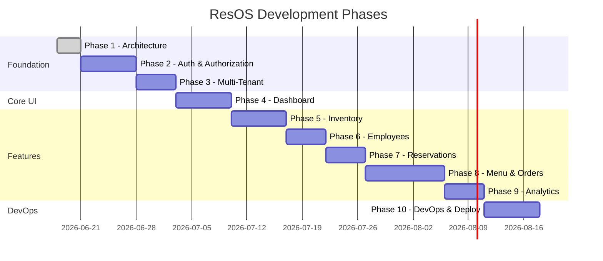
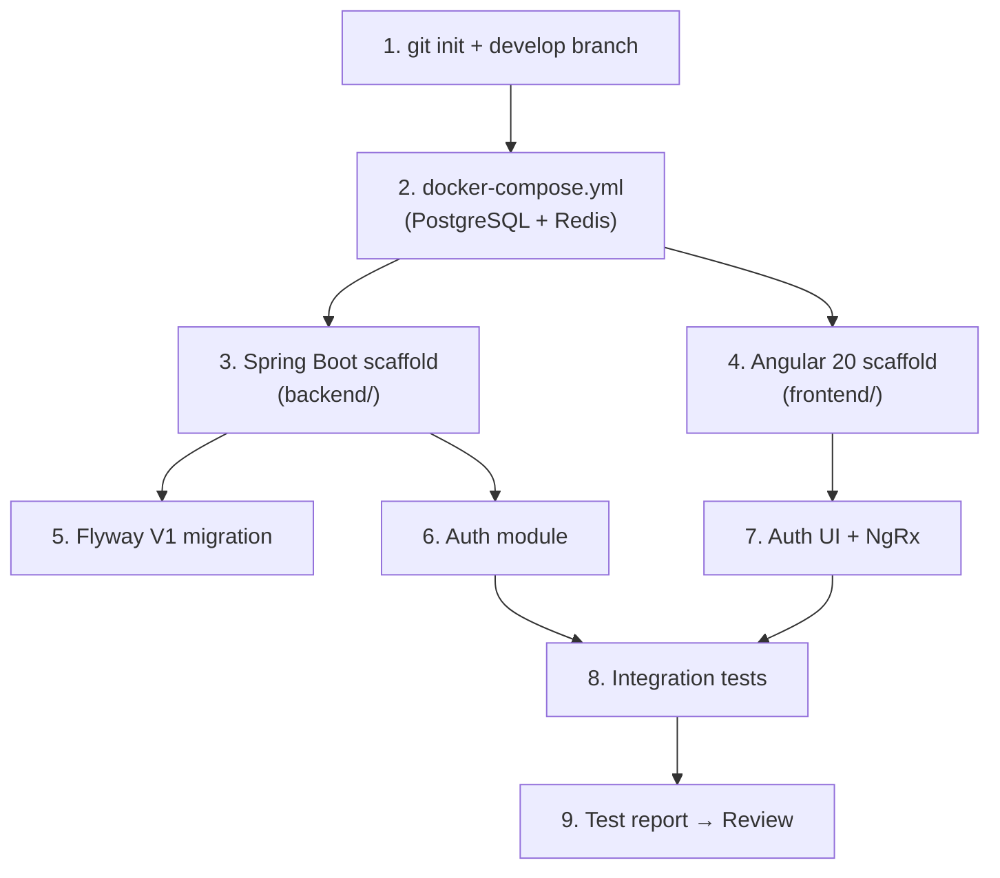

# ResOS — Development Roadmap

> **Phase 1 Deliverable** | Implementation Plan  
> **Status:** Awaiting Review

---

## 1. Roadmap Overview



---

## 2. Phase Details

---

### PHASE 1 — Project Architecture ✅ (Current)

**Branch:** `develop` (initial setup)

**Deliverables:**
- [x] System architecture diagram
- [x] Folder structure definition
- [x] Database schema design
- [x] API contract specification
- [x] Development roadmap
- [ ] **→ AWAITING REVIEW**

**Acceptance Criteria:**
- Architecture covers all 12 core features
- Multi-tenant isolation strategy documented with defense-in-depth
- All entities defined with relationships
- All API endpoints specified with request/response shapes
- Folder structure follows Clean Architecture + DDD
- Testing strategy defined per layer

---

### PHASE 2 — Authentication & Authorization

**Branch:** `feature/auth-jwt`

**Scope:**

| Component | Backend | Frontend |
|-----------|---------|----------|
| JWT access tokens (15min) | ✅ | ✅ |
| Refresh token rotation (7d) | ✅ | ✅ |
| Login / Logout / Register | ✅ | ✅ |
| RBAC (4 roles, permissions) | ✅ | ✅ |
| User CRUD | ✅ | ✅ |
| Route guards | — | ✅ |
| Auth interceptors | — | ✅ |
| NgRx auth store | — | ✅ |

**Backend Tasks:**
1. Initialize Spring Boot 3 project (Java 21, Maven)
2. Configure PostgreSQL + Flyway (V1 migration)
3. Implement `User`, `Role`, `Permission` entities
4. Implement `JwtTokenProvider` (RS256)
5. Implement `AuthService` (login, refresh, logout, register)
6. Configure Spring Security filter chain
7. Implement `AuthController` endpoints
8. Seed default roles and permissions

**Frontend Tasks:**
1. Initialize Angular 20 project (standalone components)
2. Configure Angular Material + SCSS design tokens
3. Implement login/register pages (auth layout)
4. Implement NgRx auth store (actions, reducer, effects, selectors)
5. Implement auth/tenant/error HTTP interceptors
6. Implement auth and role route guards

**Tests Required:**
| Test | Type | Priority |
|------|------|----------|
| JwtTokenProvider unit tests | Unit | P0 |
| AuthService login/logout/refresh | Unit | P0 |
| AuthController integration | Integration | P0 |
| Invalid credentials → 401 | Integration | P0 |
| Expired token → 401 | Integration | P0 |
| RBAC permission checks | Integration | P0 |
| Auth reducer/effects | Unit (FE) | P0 |
| Login component | Unit (FE) | P1 |
| Login E2E flow | Cypress | P1 |

**Commit:** `feat(auth): implement JWT authentication and refresh token workflow`

**Stop → Review → Test Report**

---

### PHASE 3 — Multi-Tenant Foundation

**Branch:** `feature/multi-tenant-foundation`

**Scope:**

| Component | Description |
|-----------|-------------|
| Tenant entity | Full CRUD, slug-based lookup |
| TenantContext | ThreadLocal holder |
| TenantFilter | Servlet filter validating JWT ↔ header |
| Hibernate @Filter | Auto tenant_id predicate |
| TenantAwareRepository | Base repository interface |
| Tenant registration | Creates tenant + owner + subscription |
| Tenant isolation tests | Cross-tenant access MUST fail |

**Backend Tasks:**
1. Flyway V2 — tenant indexes
2. Implement `Tenant`, `TenantContext`, `TenantContextHolder`
3. Implement `TenantFilter` (runs after JWT filter)
4. Configure Hibernate `@FilterDef` + `@Filter` on all tenant entities
5. Implement `TenantAwareRepository` base
6. Implement `TenantService` + `TenantController`
7. Subscription plan seeding + trial assignment on registration

**Frontend Tasks:**
1. NgRx tenant store
2. Tenant interceptor (adds `X-Tenant-ID` header)
3. Tenant settings page (basic)

**Tests Required:**
| Test | Type | Priority |
|------|------|----------|
| Tenant A cannot read Tenant B inventory | Integration | P0 |
| Tenant A cannot update Tenant B order | Integration | P0 |
| Missing X-Tenant-ID → 400 | Integration | P0 |
| Mismatched tenant header vs JWT → 403 | Integration | P0 |
| SUPER_ADMIN cross-tenant access | Integration | P1 |
| TenantFilter unit tests | Unit | P0 |
| Tenant isolation E2E | Cypress | P0 |

**Commit:** `feat(tenant): implement multi-tenant isolation with defense-in-depth`

**Stop → Review → Test Report**

---

### PHASE 4 — Restaurant Dashboard

**Branch:** `feature/dashboard-ui`

**Scope:**

| Component | Description |
|-----------|-------------|
| Dashboard layout | Sidebar nav, header, content area |
| Theme system | Light/dark mode toggle |
| KPI widgets | Revenue, orders, reservations, stock alerts |
| Revenue chart | 7-day trend |
| Recent orders table | Last 10 orders |
| Navigation | All module routes (placeholder pages) |
| Responsive design | Mobile, tablet, desktop breakpoints |

**Design System (Shared UI Components):**
- `ButtonComponent` — Primary, secondary, ghost, danger variants
- `CardComponent` — Content container with optional header/footer
- `KpiWidgetComponent` — Metric + trend indicator
- `DataTableComponent` — Sortable, paginated table
- `PageHeaderComponent` — Title + breadcrumbs + actions
- `SidebarComponent` — Collapsible navigation
- `StatusBadgeComponent` — Color-coded status pills
- `LoadingSpinnerComponent`
- `EmptyStateComponent`
- `ToastComponent` — Notification toasts

**Backend Tasks:**
1. Flyway V3 — restaurants, subscriptions
2. Restaurant CRUD endpoints
3. Dashboard KPI aggregation service
4. Revenue chart data endpoint

**Frontend Tasks:**
1. SCSS design tokens (colors, typography, spacing, shadows)
2. Theme service (light/dark toggle, localStorage persistence)
3. Dashboard layout component
4. All shared UI components listed above
5. Dashboard page with KPI widgets + chart + recent orders
6. Placeholder routes for all future modules

**Tests Required:**
| Test | Type | Priority |
|------|------|----------|
| DashboardKpiService aggregation | Unit | P0 |
| Dashboard API endpoints | Integration | P0 |
| KpiWidget component render | Unit (FE) | P1 |
| Theme toggle persistence | Unit (FE) | P1 |
| Responsive layout | Cypress | P1 |
| Dark mode toggle | Cypress | P2 |

**Commit:** `feat(dashboard): implement responsive dashboard layout with KPI widgets`

**Stop → Review → Test Report**

---

### PHASE 5 — Inventory Management

**Branch:** `feature/inventory-management`

**Deliverables:** Inventory CRUD, stock transactions, low-stock alerts, audit logs

**Commit:** `feat(inventory): implement inventory CRUD with stock alerts and audit logging`

---

### PHASE 6 — Employee Management

**Branch:** `feature/employee-management`

**Deliverables:** Employee CRUD, shift scheduling, role-based permissions

**Commit:** `feat(employees): implement employee management and scheduling`

---

### PHASE 7 — Reservation Management

**Branch:** `feature/reservation-management`

**Deliverables:** Table management, reservation CRUD, calendar view, capacity checks

**Commit:** `feat(reservations): implement table reservations with calendar view`

---

### PHASE 8 — Menu & Order Management

**Branch:** `feature/menu-order-management`

**Deliverables:** Menu builder, categories, order lifecycle, kitchen status tracking

**Commit:** `feat(orders): implement menu builder and order management system`

---

### PHASE 9 — Analytics

**Branch:** `feature/analytics`

**Deliverables:** Revenue, inventory, and employee analytics dashboards

**Commit:** `feat(analytics): implement revenue, inventory, and employee analytics`

---

### PHASE 10 — DevOps & Deployment

**Branch:** `feature/devops-deployment`

**Deliverables:**
- Docker Compose (dev + prod)
- Backend + Frontend Dockerfiles
- GitHub Actions CI pipeline
- Jenkins CD pipeline
- Production deployment guide
- AWS architecture documentation

**Commit:** `chore(devops): add Docker, CI/CD pipelines, and deployment guide`

---

## 3. Testing Gates (Every Phase)

Before moving to the next phase, ALL of the following must pass:

```
┌─────────────────────────────────────────────┐
│              TEST GATE CHECKLIST             │
├─────────────────────────────────────────────┤
│ □ Unit tests pass (backend)                 │
│ □ Unit tests pass (frontend)                │
│ □ Integration tests pass                    │
│ □ API validation (manual/collection)        │
│ □ UI validation (manual)                    │
│ □ Edge case testing documented              │
│ □ Error handling verified                   │
│ □ Tenant isolation tests pass (if applicable)│
│ □ Test report generated                     │
│ □ Code review approved                      │
└─────────────────────────────────────────────┘
```

---

## 4. Technology Initialization Order

When Phase 2 begins (after approval):



---

## 5. Risk Register

| Risk | Impact | Mitigation |
|------|--------|------------|
| Cross-tenant data leak | Critical | Defense-in-depth + mandatory isolation tests |
| JWT secret compromise | High | RS256 asymmetric keys, short-lived tokens |
| N+1 query performance | Medium | JPA fetch joins, pagination, Redis caching |
| Concurrent order modifications | Medium | Optimistic locking (`version` column) |
| Frontend state desync | Medium | NgRx for global state, refetch on navigation |
| Schema migration failures | High | Flyway versioning, rollback scripts, staging first |

---

## 6. Definition of Done (Per Feature)

- [ ] Feature plan documented
- [ ] Acceptance criteria met
- [ ] Code follows project conventions
- [ ] Unit tests written and passing
- [ ] Integration tests written and passing
- [ ] API endpoints match contract spec
- [ ] UI matches design requirements
- [ ] Tenant isolation verified (if applicable)
- [ ] Error handling covers edge cases
- [ ] No linter warnings
- [ ] Test report generated
- [ ] Commit message follows conventional commits
- [ ] Code review approved

---

## 7. Current Status

| Phase | Status | Notes |
|-------|--------|-------|
| Phase 1 — Architecture | **COMPLETE — Awaiting Review** | All docs in `/docs/` |
| Phase 2 — Auth | Blocked | Waiting for Phase 1 approval |
| Phase 3 — Multi-Tenant | Blocked | — |
| Phase 4 — Dashboard | Complete | Awaiting review |
| Phase 5 — Inventory | Complete | Awaiting review |
| Phase 6 — Employees | Complete | Awaiting review |
| Phase 7 — Reservations | Complete | Awaiting review |
| Phase 8 — Menu & Orders | Blocked | — |
| Phase 9 — Analytics | Blocked | — |
| Phase 10 — DevOps | Blocked | — |

---

**Action Required:** Review Phase 1 deliverables and approve before proceeding to Phase 2.
